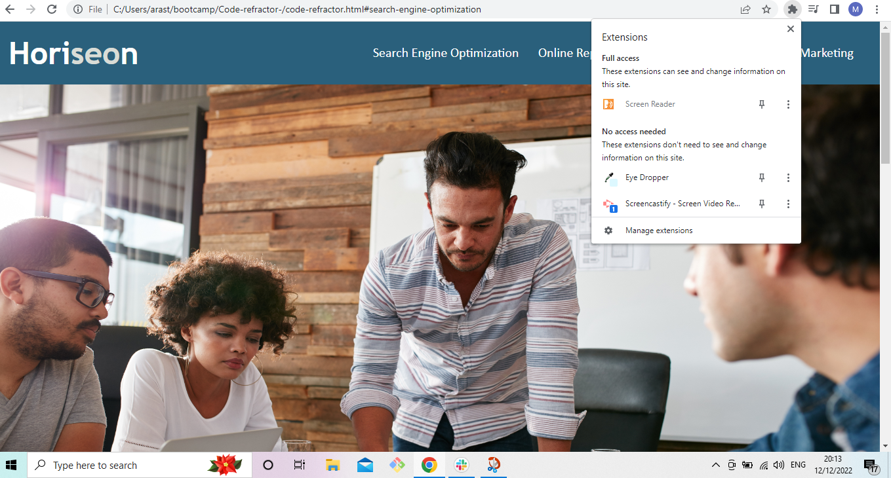
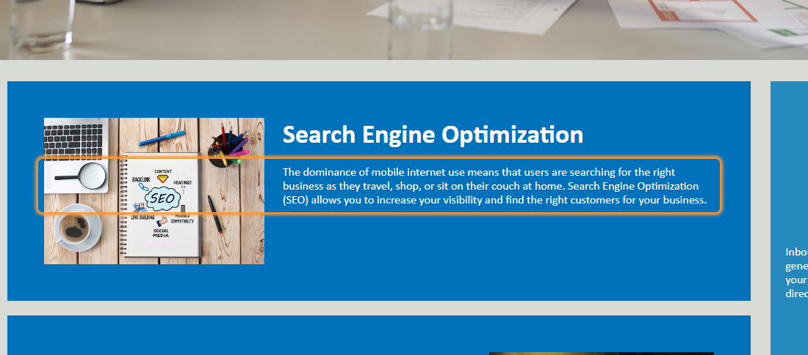

# Horiseon code refractor project.

## Description.
In this project, I worked to make the Horiseon page more accessible to all the users. I added descriptions to the pictures, that I also tested with a screen reader extension. I also edited the code to add the semantics html, and I edited and removed several css lines to make the code easier to navigate.

## Installation
Installation is not needed as the modification have already been implemented.

## Usage
It is possibile to easily scroll throught the page; otherwise it's possibile to click on one of the options in the navigation panel, and you'll be redirected to the interested parapgraph.
Also, with any screenreader, you'll be able to click on any section of the page, and the content of it will be read out loud. 
As you can see from the two screenshots below, you'll just need to enable a screen reader extension, and then you'll just need to click on the section that you'd like to be read.

## Credits
To the test the pictures caption I used Screen reader by Google: https://chrome.google.com/webstore/detail/screen-reader/kgejglhpjiefppelpmljglcjbhoiplfn

License
The last section of a good README is a license. This lets other developers know what they can and cannot do with your project. If you need help choosing a license, use https://choosealicense.com/

🏆 The sections listed above are the minimum for a good README, but your project will ultimately determine the content of this document. You might also want to consider adding the following sections.

Badges

Badges aren't necessary, per se, but they demonstrate street cred. Badges let other developers know that you know what you're doing. Check out the badges hosted by shields.io. You may not understand what they all represent now, but you will in time.

Features
If your project has a lot of features, consider adding a heading called "Features" and listing them there.

Contributing
If you created an application or package and would like other developers to contribute it, you will want to add guidelines for how to do so. The Contributor Covenant is an industry standard, but you can always write your own.

Tests
Go the extra mile and write tests for your application. Then provide examples on how to run them.

© 2022 edX Boot Camps LLC. Confidential and Proprietary. All Rights Reserved.
